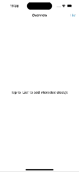

# Stocks app by using Polygon.io

iOS project that uses Poligon.io, SwiftUI and SwiftData.

# Installation

The project doesn't have any third party dependencies so it only requires Xcode 15.4+. 
API key for Polygon.io is hardcoded at moment but may not be available later.

## Demo

## Architecture

In original version I've tried to use [MVVM + Clean Architecture](https://tech.olx.com/clean-architecture-and-mvvm-on-ios-c9d167d9f5b3). However SwiftData brought complications so solution doesn't have clear separtion in some places.

## Limitations and Notes

 1. Polygon.io API has a limit of 5 API call per minute. Currently app doesn't handle cases when request are rejected
 2. Because of API limitations app preceeds some stocks and uses only API call when user taps "search" button
 3. Daily change for stock price is calculated by requesting a week of data and comparing last two days of traiding average prices since Nasdaq usually [doesn't have very long holidays](https://www.nasdaq.com/market-activity/stock-market-holiday-schedule).
 

## References

 - Preceed stocks are taken from [HERE](http://www.nasdaqtrader.com/dynamic/symdir/nasdaqlisted.txt)
 - App icon is generated by using [AI](https://perchance.org/ai-icon-generator)

